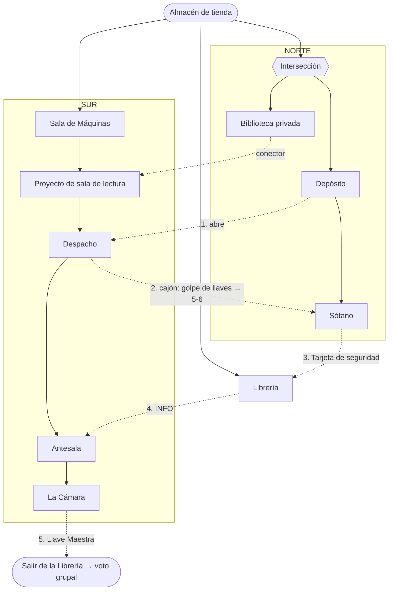

# Hoja de ruta: "EL libro PERDIDO" (Santas Ochova)

> Fuente de verdad del DISEÑO. Topología, costes y rutas en `src/components/screens/Minimap.tsx`
> (`ROOMS` / `LINKS` / `ROUTES`). El contenido de los puzzles se diseña aquí antes de implementarse.

## 1. Premisa y meta

- **Premisa**: librería de mercado negro de libros "Santas Ochova". 6 jugadoras buscan el libro perdido.
- **Meta / final**: llegar a **La Cámara** (hab. 10), la cámara oculta de Santas Ochova, y hallar allí ***La
  jauría humana*** (ed. 1975, con "Hawes") y la verdad sobre Higgins y Ruby. La **Llave Maestra** del puzzle final
  abre la **salida de la Librería** y dispara el **voto grupal** (§ final). Salir no es "ganar": abre la decisión moral.
- **Llaves**: fungibles genéricas. Resolver un puzzle = +1 llave; cruzar una puerta cerrada cuesta llaves.
- **Ruta única**: aunque el mapa tiene dos ramas (norte/sur), la ruta EFECTIVA es **una sola**, forzada por las
  **dependencias de los puzzles** (§3), no por las puertas. Te puedes mover libre si tienes llaves, pero solo
  *progresas* (resolver, conseguir items) en un orden.
- **El minimapa es UN programa** dentro de `Computer.tsx` (con la terminal, la tienda online, el chat, más los
  documentos físicos de la mesa). La ruta de puzzles es guiada, pero la partida NO es lineal: las 6 jugadoras
  trastean a la vez distintas superficies. El paralelismo y lo colaborativo vienen de ahí, no de ramificar los
  puzzles. (Sustituye a la idea vieja de "3 ramas paralelas" de `escape-room-libreria.md` §8.)

## 2. Dos capas (clave del diseño)

- **Puertas = candados por LLAVE genérica.** Marcan el ritmo y el traslado. **Ya implementado.**
- **Puzzles = estilo Blue Prince (deducción / información), NO aritmética.** Un puzzle puede necesitar un
  **ITEM** o una **INFO** de OTRA sala para poder entenderse o resolverse. Esta capa es la que fuerza la ruta
  única. **Mecánica NUEVA** (inventario + flags + prerrequisitos de puzzle + puertas por item/código); pendiente.

## 3. Salas y la cadena de dependencias (ruta única)

| Nº | Sala | id | Puzzles | Ruta | Notas |
|----|------|----|---------|------|-------|
| 1 | Librería | `libreria` | 1 | tronco/salida | entrada; puerta de salida final |
| 2 | Almacén de tienda | `hub-almacen` | 1 | tronco | inicio |
| 3 | Depósito | `r4` | (1)\* | norte | da lo necesario para abrir el Despacho |
| 4 | Sótano | `r5` | (1)\* | norte | callejón; su puerta cuesta ~5-6 llaves (el muro); da la Tarjeta de seguridad del Almacén |
| 5 | Biblioteca privada | `r3` | (1)\* | norte | toca el Proyecto (conector) |
| 6 | Proyecto de sala de lectura | `r2` | 3 | sur | central, nudo |
| 7 | Sala de Máquinas | `r1` | 2 | sur | calderas, plomos |
| 8 | Despacho | `r6` | código | sur | carta + código físicos → golpe de llaves de una vez (de 1-3 a 5-6, para el Sótano) |
| 9 | Antesala | `r7` | (1)\* | sur | se pasa con la info de la Librería; rol concreto por definir |
| 10 | La Cámara | `r8` | (1)\* | sur | callejón; el libro + la Llave Maestra; en descripción se llama "Scriptorium" |

\* Provisional: puzzle de +1 llave por sala (a re-ajustar con el script, ver §4).

**Recorrido forzado** (orden en que se puede *progresar*):

1. **Almacén** (inicio).
2. **NORTE**: Almacén → Intersección → **Biblioteca privada** y **Depósito**. El **Depósito** da lo necesario para abrir el Despacho.
3. **SUR**: Almacén → Sala de Máquinas → **Proyecto de sala de lectura** → **Despacho** (se abre con lo del
   Depósito). Dentro, una **carta física** dice que el personal de limpieza pierde las llaves y guarda repuestos;
   un sobre trae un **código** que, al introducirlo, suelta un **golpe de llaves de una vez** (mirando en el
   cajón, sin puzzle) que sube el saldo normal (1-3) a las **~5-6** que cuesta abrir el **Sótano**.
4. **Backtrack al Sótano** (norte), ya con 5 llaves. Da el **ITEM "Tarjeta de seguridad del Almacén"**.
5. **Librería** (se abre con la Tarjeta). Da la **INFO** para pasar de la **Antesala** a **La Cámara**.
6. **Antesala → La Cámara** (Antesala: rol concreto por definir). Puzzle final → **ITEM "Llave Maestra"**.
7. Vuelta a la **Librería** → la Llave Maestra abre la **SALIDA** → se dispara el **voto grupal** (publicar todo / callar), con sus implicaciones sobre Higgins. Ahí acaba el juego.

Sin bucles: Depósito →(abre)→ Despacho →(+llaves → 5)→ Sótano →(Tarjeta)→ Librería →(info)→ Antesala → La Cámara →(Llave Maestra)→ Salida.

### Diagrama

Líneas continuas = corredores físicos del mapa; punteadas = **cadena de dependencias** (qué desbloquea qué), numeradas 1-5.



## 4. Economía de llaves (traslado)

**Principio**: el saldo del grupo se mantiene BAJO casi todo el juego, **1-3 llaves**, porque cada puerta cuesta
más o menos lo que da cada puzzle (economía ajustada, saldo casi plano). Así nunca acumulan de más.

- El **Sótano** es el muro: cuesta **5-6 llaves** (número exacto por afinar). Con el saldo normal (1-3) no se puede pagar.
- El **Despacho** da un **golpe de llaves de una vez** (el cajón con los repuestos): sube el saldo de 1-3 a las
  5-6 justas para el Sótano. Es la **única** fuente de ese pico, así que el muro **no se puede abrir antes** del
  Despacho. Esto resuelve la fragilidad del muro por nº de llaves, sin necesidad de item específico.
- La **Librería** se abre por Tarjeta (item), no por llaves.
- **A verificar con el script** (`npm run economy`, pendiente): que el saldo se mantiene en 1-3, que solo el
  Despacho permite llegar a 5-6, y que nunca te quedas sin pagar la siguiente puerta necesaria.

## 5. Slots de puzzle (contrato: REQUIERE → DA)

**Items especiales (solo 2):**

- **Tarjeta de seguridad del Almacén**: abre la puerta Almacén → Librería. Se consigue en el **Sótano**.
- **Llave Maestra**: abre la **salida final** (fin del juego). Se consigue en **La Cámara**.

Contenido concreto (Blue Prince, deducción): POR DISEÑAR. De momento, las dependencias:

| Sala | Requiere (para resolverse) | Da (al resolverse) |
|------|----------------------------|--------------------|
| Almacén de tienda | : | +1 llave |
| Sala de Máquinas | : | +2 llaves |
| Proyecto de sala de lectura | : | +3 llaves |
| Biblioteca privada | : | +1 llave |
| Depósito | : | +1 llave + lo necesario para **abrir el Despacho** |
| Despacho | lo del Depósito (para abrir) | **código físico → golpe de llaves de una vez** (de 1-3 a 5-6, sin puzzle); abre el **Sótano** |
| Sótano | 5-6 llaves | +1 llave + **ITEM "Tarjeta de seguridad del Almacén"** |
| Librería | **ITEM "Tarjeta de seguridad del Almacén"** | +1 llave + **INFO para la Antesala / La Cámara** |
| Antesala | **INFO de la Librería** | +1 llave (rol concreto por definir) |
| La Cámara | pasar la Antesala | +1 llave + ***La jauría humana* (1975)** + la verdad de Higgins/Ruby + **ITEM "Llave Maestra"** |
| Salida (Librería) | **Llave Maestra** | se sale de la librería → **voto grupal** (publicar / callar) → fin |

## 6. Orden de desarrollo

1. **Historia + meta** ✅
2. **Estructura: grafo + rutas + economía** ✅ (rutas cableadas; falta re-balancear y el script)
3. **Contratos de puzzle** ✅ (esta tabla; dependencias definidas)
4. **Contenido** de cada puzzle (Blue Prince) ← en marcha (empezado por el Despacho)
5. **Piel física/digital** (props); se derivan del contenido
6. **Montar + cablear + playtestear**

## 7. Pendientes

- [ ] Implementar la mecánica de la capa 2: inventario + flags + prerrequisitos de puzzle + puertas por item/código.
- [ ] Mecánica "código → +N llaves" (entrada de código que suma llaves, sin resolver puzzle; caso del Despacho).
- [ ] Re-balancear la economía con los números nuevos (Sótano = 5 llaves, Despacho = +2-3) y montar `npm run economy`.
- [ ] **Testing de soft-locks** (cuando existan los puzzles): buscar estados donde el grupo quede encerrado
  sin llaves + sin info para avanzar. El checker se amplía para mirar también info/items, no solo llaves.
- [ ] Diseñar el CONTENIDO del resto de puzzles (estilo Blue Prince, deducción/información).
- [ ] Escribir las descripciones de sala (La Cámara = doble nombre "Scriptorium").
- [ ] Derivar los props físicos del contenido.
```
