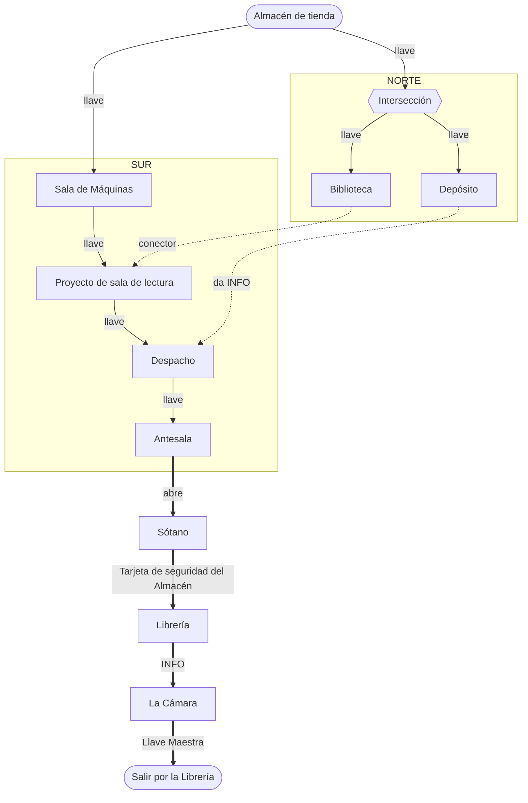

# Hoja de ruta: "EL libro PERDIDO" (Santas Ochova)

> Fuente de verdad del DISEÑO. Topología, costes y rutas en `src/components/screens/Minimap.tsx`
> (`ROOMS` / `LINKS` / `ROUTES`). El contenido de los puzzles se diseña aquí antes de implementarse.

## 1. Premisa y meta

- **Premisa**: librería de mercado negro de libros "Santas Ochova". 8 jugadoras buscan el libro perdido.
- **Meta / victoria**: encontrar el libro (objeto) en **La Cámara** (hab. 10) y salir por la **puerta final de la
  Librería** (hab. 1). La salida se abre con la **Llave Maestra** que suelta el puzzle de La Cámara.
- **Llaves**: fungibles genéricas. Resolver un puzzle = +1 llave; cruzar una puerta cerrada cuesta llaves.
- **Ruta única**: aunque el mapa tiene dos ramas (norte/sur), la ruta EFECTIVA es **una sola**, forzada por las
  **dependencias de los puzzles** (§3), no por las puertas. Te puedes mover libre si tienes llaves, pero solo
  *progresas* (resolver, conseguir items) en un orden.

## 2. Dos capas (clave del diseño)

- **Puertas = candados por LLAVE genérica.** Marcan el ritmo y el traslado. **Ya implementado.**
- **Puzzles = estilo Blue Prince (deducción / información), NO aritmética.** Un puzzle puede necesitar un
  **ITEM** o una **INFO** de OTRA sala para poder entenderse o resolverse. Esta capa es la que fuerza la ruta
  única. **Mecánica NUEVA** (inventario + flags + prerrequisitos de puzzle + puertas por item/código); pendiente.

## 3. Salas y la cadena de dependencias (ruta única)

| Nº | Sala | id | Puzzles | Ruta | Notas |
|----|------|----|---------|------|-------|
| 1 | Librería | `libreria` | 1 | tronco/salida | entrada; puerta de salida final |
| 2 | Almacén de tienda | `hub-almacen` | 1 | tronco | inicio |
| 3 | Depósito | `r4` | (1)\* | norte | da INFO para el Despacho |
| 4 | Sótano | `r5` | (1)\* | norte | callejón; da el ITEM "Tarjeta de seguridad del Almacén" |
| 5 | Biblioteca | `r3` | (1)\* | norte | toca el Proyecto (conector) |
| 6 | Proyecto de sala de lectura | `r2` | 3 | sur | central, nudo |
| 7 | Sala de Máquinas | `r1` | 2 | sur | calderas, plomos |
| 8 | Despacho | `r6` | (1)\* | sur | cerrado hasta tener la info del Depósito |
| 9 | Antesala | `r7` | (1)\* | sur | abre el Sótano |
| 10 | La Cámara | `r8` | (1)\* | sur | callejón; el libro + la Llave Maestra; en descripción se llama "Scriptorium" |

\* Propuesto: +1 puzzle por sala vacía (suministro 13, ver §4).

**Recorrido forzado** (orden en que se puede *progresar*):

1. **Almacén** (inicio).
2. **NORTE**: Almacén → Intersección → **Biblioteca** y **Depósito**. El Depósito da la **INFO** del puzzle del
   Despacho. El **Sótano** queda cerrado hasta más tarde.
3. **SUR**: Almacén → Sala de Máquinas → **Proyecto de sala de lectura**. El **Despacho** no se resuelve sin la
   INFO del Depósito. Con ella, se abre.
4. **Despacho → Antesala**. La **Antesala** abre el **Sótano** (ver §5, muro a prueba de balas). La Cámara sigue
   cerrada: aún no sabes cómo entrar.
5. **Backtrack al Sótano**. Da el **ITEM "Tarjeta de seguridad del Almacén"**.
6. **Librería** (se abre con ese item). Sus puzzles dan la **INFO para entrar en La Cámara**.
7. **Backtrack a La Cámara** (con esa info). Puzzle final → **ITEM "Llave Maestra"**.
8. Vuelta a la **Librería** → la Llave Maestra abre la **SALIDA** → fin.

Sin bucles: Depósito →(info)→ Despacho → Antesala →(abre)→ Sótano →(item)→ Librería →(info)→ La Cámara →(maestra)→ Salida.

### Diagrama

Las dos bifurcaciones salen del Almacén (norte / sur); el final es lineal. Flechas finas = puerta por llave;
punteadas = dependencia de info/item entre ramas; gruesas = el remate lineal.

## 4. Economía de llaves (traslado)

- Las puertas siguen costando llaves; hay que garantizar que **nunca te quedas sin poder pagar la siguiente
  puerta necesaria** del orden forzado, con **colchón de 2**.
- Con +1 puzzle por sala vacía → suministro **13**, coste mínimo **11**, superávit **2** (verificado).
- `npm run economy` (pendiente): simulará el **orden forzado** y comprobará que el saldo nunca baja de 0 y
  acaba ≥ 2.

## 5. Slots de puzzle (contrato: REQUIERE → DA)

**Items especiales (solo 2):**

- **Tarjeta de seguridad del Almacén**: abre la puerta Almacén → Librería. Se consigue en el **Sótano**.
- **Llave Maestra**: abre la **salida final** (fin del juego). Se consigue en **La Cámara**.

Contenido concreto (Blue Prince, deducción): POR DISEÑAR. De momento, las dependencias:

| Sala | Requiere (para resolverse) | Da (al resolverse) |
|------|----------------------------|--------------------|
| Almacén de tienda | : | +1 llave |
| Sala de Máquinas | : | +2 llaves |
| Proyecto de sala de lectura | : | +3 llaves |
| Biblioteca | : | +1 llave |
| Depósito | : | +1 llave + **INFO para el Despacho** |
| Despacho | **INFO del Depósito** | +1 llave |
| Antesala | : | +1 llave + **abre el Sótano** (código/item específico, no por nº de llaves) |
| Sótano | lo de la Antesala | +1 llave + **ITEM "Tarjeta de seguridad del Almacén"** |
| Librería | **ITEM "Tarjeta de seguridad del Almacén"** | +1 llave + **INFO para La Cámara** |
| La Cámara | **INFO de la Librería** | +1 llave + **ITEM "Llave Maestra"** (victoria) |
| Salida (Librería) | **Llave Maestra** | fin del juego |

## 6. Orden de desarrollo

1. **Historia + meta** ✅
2. **Estructura: grafo + rutas + economía** ✅ (rutas cableadas; falta aplicar puzzles y el script)
3. **Contratos de puzzle** ✅ (esta tabla; dependencias definidas)
4. **Contenido** de cada puzzle (Blue Prince) ← siguiente
5. **Piel física/digital** (props); se derivan del contenido
6. **Montar + cablear + playtestear**

## 7. Pendientes

- [ ] Implementar la mecánica de la capa 2: inventario + flags + prerrequisitos de puzzle + puertas por item/código.
- [ ] Aplicar +1 puzzle a R3–R8 (suministro 13).
- [ ] `npm run economy` que simule el orden forzado.
- [ ] **Testing de soft-locks** (cuando existan los puzzles): buscar estados donde el grupo quede encerrado
  sin llaves + sin info para avanzar. El checker se amplía para mirar también info/items, no solo llaves.
- [ ] Diseñar el CONTENIDO de cada puzzle (estilo Blue Prince, deducción/información).
- [ ] Escribir las descripciones de sala (La Cámara = doble nombre "Scriptorium").
- [ ] Derivar los props físicos del contenido.
